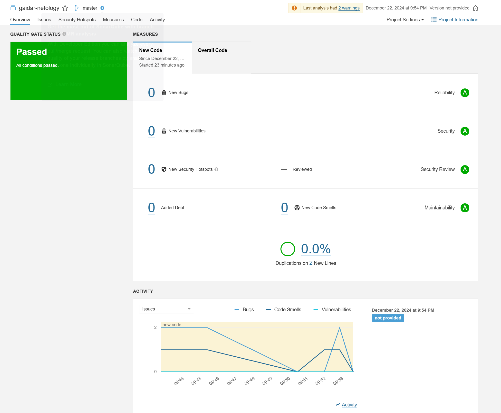

# Домашнее задание к занятию 9 «Процессы CI/CD»

## Знакомоство с SonarQube

## Знакомство с Nexus

[maven-metadata.xml](maven-metadata.xml)

## Знакомство с Maven

[Исправленный pom.xml](mvn/pom.xml)